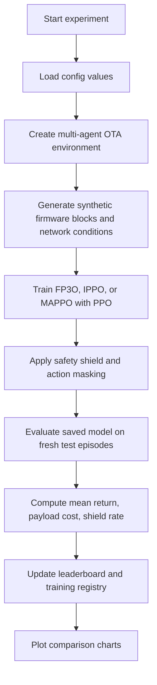
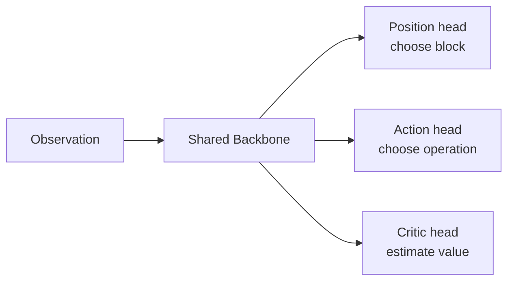

# MA-ReLES-OTA: Multi-Agent Reinforcement Learning for Coordinated Automotive OTA Updates

**Authors:** not explicitly listed in the repository. The README names these contributors: Saadman Sakib, Mohtasim Dipto, and Mahin Islam.

**One-sentence summary:** This research studies how several vehicle computers can safely and efficiently decide which firmware update actions to take when they all share limited memory and noisy network conditions.

> Note: this repository contains a mix of current code, older notes, and intermediate experiment logs. When two files disagree, this explanation follows the current code and the recorded results, and it clearly points out older notes that are now stale.

## 2. Executive Summary

Modern vehicles contain many small computers called ECUs, short for Electronic Control Units. These computers control things like the engine, brakes, and infotainment system. They sometimes need software updates sent over the air, which means the update arrives through a network instead of through a cable or a workshop visit. That sounds simple, but in practice it is hard because many ECUs may need updates at the same time, the network may be slow or lossy, and the vehicle has limited memory for holding update data.

This project asks a practical question: how can several ECUs work together so that the total update cost stays low, the memory limit is not exceeded, and the system still works under difficult network conditions such as Bangladesh-style congestion and jitter? The answer explored here is multi-agent reinforcement learning, which means several learning agents make decisions together and improve from experience. The code combines a shared neural network backbone, special action heads for different ECU types, a safety shield that blocks dangerous memory use, and Shapley-based credit assignment so each agent gets a fair share of the team reward.

The project is important because real OTA updates are not just about saving bytes. They are about avoiding failed updates, reducing delays, and preventing memory overflow in safety-critical vehicles. A bad update strategy could waste bandwidth, slow down a fleet, or even stop an ECU from updating at all. Compared with earlier single-agent or independent-agent methods, this work tries to coordinate multiple agents at once and make the system safer.

The repository shows a long research journey. Early runs were very poor, with huge negative returns, which means the updates were expensive and inefficient. Later fixes improved the learning process, the safety logic, the rollout frequency, and the stability of training. The current leaderboard reports a positive mean return for the latest FP3O run, but the payload cost target is still not met, so the project is promising rather than finished.

## 3. Background

### What is OTA?

OTA stands for over-the-air. It means software is delivered through a wireless network instead of by plugging the device into a cable. Think of it like receiving a package by drone instead of going to a shop.

### What is an ECU?

An ECU is a small computer inside a vehicle. Each ECU has its own job. One may manage the engine, another the brakes, another the radio or screen. A modern car can have dozens of them.

### What is firmware?

Firmware is the low-level software that lives inside a device and tells the hardware what to do. A smartphone app is not firmware, but the code inside a brake controller is.

### Why is OTA hard in vehicles?

Vehicles are not like regular laptops. They have tight memory budgets, different hardware types, strict safety needs, and sometimes poor network conditions. If several ECUs update at once, they can compete for the same memory and bandwidth.

### What is reinforcement learning?

Reinforcement learning is a way for software to learn by trial and error. The agent takes an action, gets a reward or penalty, and slowly learns which actions are better. A simple analogy is training a dog with treats, except here the “dog” is a neural network.

### What is multi-agent reinforcement learning?

Multi-agent reinforcement learning, or MARL, means several learning agents act in the same environment. They may compete, cooperate, or both. In this project, they cooperate because the ECUs all belong to the same fleet and share the same limited resources.

### What is CTDE?

CTDE means Centralized Training, Decentralized Execution. During training, the model can use more information, like a coach watching the whole game. During execution, each agent acts with its own local view, like a player who only knows what is in front of them. This helps learning while keeping test-time decisions realistic.

### Required knowledge in simple terms

You only need a few ideas to understand the project:

- A computer can learn from rewards.
- Several computers can learn together.
- Memory and network bandwidth are limited resources.
- Safety matters more than raw speed in vehicle software.

## 4. The Problem

The real problem is not just “send updates.” The real problem is “send many updates safely and cheaply when the vehicle has limited memory and a noisy network.”

This is difficult because:

- Each update action can use a different amount of memory and bandwidth.
- Some actions are cheaper but less flexible, while others are safer but more expensive.
- Multiple ECUs can interfere with one another if they all try to update at the same time.
- Bad network conditions can increase delay and packet loss.
- Safety-critical ECUs, like braking, should not be treated the same as infotainment ECUs.

Who is affected?

- Vehicle manufacturers, because they need reliable update systems.
- Fleet operators, because bad updates cost money and time.
- Drivers and passengers, because failed updates can affect safety and convenience.
- Researchers, because OTA update scheduling is a hard optimization problem.

Real-world example:

Imagine four delivery workers trying to unload boxes into one small storage room. If they all rush in without coordination, they block each other, fill the room too quickly, and may lose items. A better plan is to coordinate who enters first, what each person carries, and when to stop before the room overflows. That is similar to this OTA problem.

## 5. Why Previous Solutions Were Not Enough

The repository shows several earlier approaches and baselines. Each one helps, but none fully solves the combined problem of coordination, safety, and heterogeneity.

| Previous method | How it works | Strengths | Weaknesses | Why it was not enough |
|---|---|---|---|---|
| Random baseline | Chooses update actions at random | Very simple; useful as a sanity check | Wastes memory and bandwidth | Does not learn anything |
| Sequential baseline | Updates blocks in order | Easy to understand | Ignores efficiency and network conditions | Cannot adapt to hard cases |
| Single-agent PPO from Phase 1 | One learning agent chooses update actions | Better than random; learns from reward | Only one agent; does not model fleet coordination | Not enough for multiple ECUs |
| IPPO | Each agent learns separately | Scales to multiple agents; simple MARL baseline | Agents do not share a global team view | Coordination remains weak |
| MAPPO | Uses a centralized critic during training | Better cooperation than IPPO | Still may treat all agents too similarly | Heterogeneous ECUs need more structure |
| FP3O | Shared backbone plus specialized heads | Better fit for different ECU types | More complex to implement | Needed to handle heterogeneity and coordination |

Why these were insufficient in plain English:

- Random and sequential methods do not learn from experience.
- Single-agent PPO does not understand that several ECUs are acting together.
- IPPO learns separately, so each agent may behave as if the others do not exist.
- MAPPO improves teamwork, but it still does not fully specialize by ECU type.
- FP3O is closer to the problem because it shares common knowledge but still allows different ECU types to behave differently.

## 6. Research Gap

The missing piece was a system that could do all of the following at once:

- Coordinate multiple ECUs.
- Handle limited memory safely.
- Work under noisy network conditions.
- Treat different ECU types differently.
- Produce reproducible experimental results.

Earlier work knew parts of this problem existed. For example, researchers already knew about multi-agent learning, safety shields, and Shapley credit assignment. But the repository shows that bringing all of them together in one OTA update pipeline was still unfinished.

Why had it not been fully solved?

- The environment is complicated and easy to break.
- Safety limits can cause unstable training if penalties are too large.
- Multiple agents create harder credit assignment, meaning it becomes harder to tell which agent caused the good or bad outcome.
- Some earlier notes in the repo were written before later fixes, so the project evolved over time rather than arriving fully formed.

## 7. Why This Research Was Chosen

This topic was chosen because OTA updates are a real problem in modern vehicles and because a thesis project needs a problem that is both practical and research-worthy.

The motivation appears to be:

- Vehicles are becoming more like mobile computer systems.
- Update failures are expensive and sometimes unsafe.
- The Bangladeshi network setting adds a realistic congestion challenge.
- A multi-agent solution is more realistic than a single-agent toy model.

This is worthwhile because it connects three useful goals:

- engineering usefulness,
- academic novelty,
- and safety-aware decision making.

## 8. Main Idea of This Research

The big idea is to let several ECU agents learn how to update themselves together instead of one at a time.

The method does not just ask “which block should be updated next?” It also asks:

- Which operation is cheapest?
- Which ECU type am I?
- How much memory is left?
- Should the safety shield block this action?
- How much credit should each agent get for helping the team?

The core intuition is simple:

- Share what is common.
- Specialize where tasks differ.
- Block unsafe behavior before it breaks the system.
- Reward each agent fairly.

Analogy:

Think of a sports team. All players need the same general rules, but the goalkeeper, defender, and striker do not play the same role. A good coach gives the whole team a shared plan, but also gives each position different instructions. That is the logic behind FP3O.

## 9. How the Proposed Method Works

### High-level workflow

### What happens during one training step?

1. Each ECU agent sees its own observation.
2. The observation includes which firmware blocks are still available, how much cost has been spent, memory usage, the step number, the agent identity, and a shared state vector.
3. The policy chooses a block index and an operation type.
4. The environment checks whether the action is valid.
5. If memory would go too high, the safety shield may block the action.
6. The environment computes the reward from encoding cost, transmission cost, and memory overhead.
7. The policy updates its neural network based on that reward.

### What is in the observation?

The environment gives each agent a small package of information:

- `mask`: which firmware blocks are still available.
- `cum_encoding_cost`: how much encoding cost has already been paid.
- `cum_tx_cost`: how much transmission cost has already been paid.
- `memory_used`: how much of the memory budget is used.
- `step`: how many steps the agent has taken.
- `agent_id`: which ECU this is.
- `state`: a global state summary for centralized training.

### Why death masking exists

When an agent finishes, the environment does not remove it completely. Instead, it returns a zero-filled observation for most fields, while keeping the agent ID. This is called death masking.

Why this is needed:

- It keeps the input size fixed.
- It avoids confusing the centralized critic when some agents are done and others are still active.
- It makes vectorized training easier.

Analogy:

If a classroom student leaves early, you do not rebuild the classroom layout. You just leave an empty chair and note that the seat is empty. Death masking is the machine-learning version of that.

### What is the safety shield?

The safety shield is a rule-based guard. If a proposed action would push memory use too high, the shield can override it or block it.

Why it matters:

- It prevents unsafe exploration.
- It keeps the environment from crashing too often.
- It makes the learning problem closer to a real vehicle system, where safety is not optional.

Analogy:

A seatbelt does not help you drive faster, but it prevents a bad mistake from becoming a disaster. The safety shield plays a similar role.

### What is Shapley credit assignment?

Shapley values come from cooperative game theory. They measure how much each team member contributes on average when joining a group.

In this project, the environment estimates each agent’s contribution by looking at how the team reward changes when that agent joins different coalitions.

Why this is useful:

- It gives fairer credit in cooperative tasks.
- It helps prevent one agent from getting blamed or praised for another agent’s work.

Analogy:

If several friends split a restaurant bill, you would not want one person paying for everyone else’s dessert. Shapley-style credit tries to split the bill in a fairer way based on contribution.

### What is the neural network structure?

The FP3O policy has three important parts:

- A shared backbone that learns general patterns.
- Specialized action heads that handle different ECU types.
- A centralized critic that estimates the value of the current state during training.

The shared backbone in the code is a multi-layer perceptron with widths 256, 256, and 128. The specialized heads then produce logits for the two action parts: which block to update and which operation to use.

### Why the policy is specialized

Different ECU types may need different behavior. For example, a braking ECU should be handled more conservatively than an infotainment ECU. The policy therefore allows different heads for engine, braking, infotainment, and generic ECUs.

### How training and evaluation differ

Training:

- The model learns from rewards and penalties.
- The critic helps estimate future returns.
- The safety shield and action masking can shape behavior.

Evaluation:

- The saved model is loaded from disk.
- Deterministic actions are used.
- The model is tested on fresh episodes.
- The code reports return, payload cost, and shield rate.

## 10. Data Used

This repository does not use a public vehicle dataset. Instead, it creates synthetic data inside the environment.

### What data is generated?

- Random “old” firmware blocks.
- Random “new” firmware blocks.
- Similarity bias values between 0.4 and 0.9.
- Bangladesh network parameters from `bd_params.json`.
- Episode seeds for reproducible runs.

### Why synthetic data was used

The goal is to study the decision process, not to copy a real vehicle firmware database. Synthetic data makes it possible to:

- test the algorithm safely,
- change the problem size easily,
- and reproduce results from seed to seed.

### Preprocessing and assumptions

The environment transforms the raw block information into costs:

- encoding cost,
- transmission cost,
- memory overhead.

It assumes that block similarity affects how expensive a block is to update. It also assumes the Bangladesh network settings can be approximated by the JSON file values such as base latency, packet loss, and memory budget fraction.

### Important note

Because the data is synthetic, the results show how well the algorithm works in this simulated environment. They do not yet prove how it will behave on a real vehicle fleet.

## 11. Experimental Setup

### Software stack

The repository and logs mention the following tools:

- Python 3.10+ in the README, with a Windows 3.12 environment used during implementation.
- PyTorch.
- Gymnasium.
- PettingZoo.
- Stable-Baselines3.
- sb3-contrib.
- SuperSuit.
- Pandas.
- SciPy.
- Matplotlib and Seaborn.

### Hardware reported in the README

- CPU: AMD Ryzen 5 5600.
- GPU: NVIDIA GeForce RTX 3060 with 12 GB VRAM.
- RAM: 12 GB.

### Training settings from the current config

The current `config.py` and training code use values such as:

- `n_agents = 4`
- `n_blocks = 16`
- `n_envs = 4`
- `n_steps = 256`
- `batch_size = 128`
- `n_epochs = 10`
- `learning_rate = 3e-4`
- `gamma = 0.99`
- `gae_lambda = 0.95`
- `ent_coef = 0.001`
- `total_timesteps = 2_000_000`
- `n_seeds = 10`

### Why these choices were made

- Multiple environments speed up data collection.
- Smaller rollout horizons increase the number of PPO updates.
- A moderate batch size stabilizes gradient updates.
- The low entropy coefficient reduces random behavior once the policy starts learning.
- Multiple seeds improve scientific reliability.

### Evaluation setup

The evaluation code runs deterministic rollouts on a fresh test environment. It uses a separate seed range so training data does not leak into testing. The current leaderboard shows results averaged over the seeds that were actually run.

### A note about changing defaults

Older README notes mention `n_envs = 10`, `n_steps = 2048`, and different timesteps. The current config has smaller rollouts and more frequent updates. That change was made after the project log showed the original setup was not updating often enough.

## 12. Results

The repository records a clear improvement story, but it also shows that progress was not smooth.

### Current leaderboard snapshot

| Experiment | Mean Return | 95% CI | Mean Payload Cost | Shield Rate | Agents | Blocks |
|---|---:|---:|---:|---:|---:|---:|
| FP3O_Safety_True | 11.44 | 1.21 | 39,250.4 | 0.0 | 4 | 16 |

Interpretation:

- A positive mean return means the policy is no longer losing value overall in the recorded run.
- The confidence interval is narrow, which suggests the two recorded seeds were similar.
- The safety shield did not activate in the latest recorded run.
- The payload cost is still far above the benchmark payload target in `config.py`, so the system is not yet perfect.

### Representative historical results from the registry

| Run | Setting | Mean Return | Mean Payload Cost | Shield Rate | What it shows |
|---|---|---:|---:|---:|---|
| Early FP3O smoke test | 4 agents, 16 blocks | -25.7994 | not recorded | not recorded | The code could run, but performance was still limited |
| FP3O after early full training | 4 agents, 16 blocks | -8593.8392 | 2329.4 | 0.0 | Training existed, but the reward scale and policy were still poor |
| IPPO baseline | 4 agents, 16 blocks | -8495.7909 | 2266.0 | 0.0 | Independent learning was not enough |
| FP3O tuning run | 4 agents, 16 blocks | -193.2146 | 12,195.2 | 0.0452 | Better than the early runs, but still not close to the target |
| Latest leaderboard row | 4 agents, 16 blocks | 11.44 | 39,250.4 | 0.0 | Best recorded return so far in this repository |

### What changed over time?

The project improved as the following issues were fixed:

- reward scaling was corrected,
- invalid action penalties were tuned,
- the safety shield bug was fixed,
- the rollout schedule was made more update-friendly,
- and the GPU installation issue was resolved.

### What the numbers mean in simple English

- Better return means the update plan costs less overall.
- Lower payload cost means fewer bytes are moved.
- Lower shield rate means the safety guard rarely needs to intervene.
- Narrower confidence intervals mean the result is more repeatable.

## 13. Before vs After

| Aspect | Before | After |
|---|---|---|
| Decision style | Random or sequential or independent agents | Coordinated multi-agent learning |
| Safety handling | Weak or missing | Safety shield blocks unsafe memory use |
| Credit assignment | Crude or absent | Shapley-based team credit |
| ECU specialization | One generic behavior | Specialized heads for different ECU types |
| Training stability | Many unstable runs | Better stability after rollout and reward fixes |
| Evaluation | Often placeholder or incomplete in older notes | Real deterministic evaluation on saved models |
| Reproducibility | Some seeds were accidentally duplicated | Per-seed logging and registry tracking |
| Comparison tracking | Manual or partial | Leaderboard, charting, and registry tools |

### A more direct comparison

| Method | Speed | Accuracy of coordination | Safety | Practicality |
|---|---|---|---|---|
| Random | Low | Very poor | Low | Only useful as a baseline |
| Sequential | Low to medium | Poor | Low | Easy, but not smart |
| IPPO | Medium | Better than random | Medium | Good baseline, but weak teamwork |
| FP3O with safety | Medium | Best in this repo | Higher | Most practical current solution |

## 14. Does This Research Actually Help?

Yes, but with conditions.

Who benefits?

- Researchers who need a testbed for multi-agent OTA scheduling.
- Vehicle software teams who want to study coordination and safety together.
- Students who want a realistic MARL example.

Who may not benefit yet?

- Companies that need a production-ready OTA scheduler today.
- Teams that require proof on real vehicle telemetry rather than synthetic simulation.

Where can it be used?

- As a research benchmark.
- As a teaching example.
- As a starting point for more realistic fleet update systems.

Industry relevance:

- It addresses bandwidth, memory, and safety constraints that real vehicle platforms face.

Academic relevance:

- It combines MARL, safety shields, and fair credit assignment in one domain-specific environment.

Practical usefulness:

- Useful now for experimentation and learning.
- Not yet fully proven for direct deployment.

## 15. Are the Results Satisfactory?

Partly yes.

What was achieved:

- The repository now has a working multi-agent environment.
- The training and evaluation pipeline runs end to end.
- The latest recorded run achieved a positive mean return.
- The safety shield can keep activation at zero in the latest run.

What is only partially achieved:

- The payload cost is still too high compared with the benchmark target.
- The repository still contains older notes and tests that do not fully match the latest design.
- There is no current multi-algorithm leaderboard showing a final IPPO versus MAPPO versus FP3O comparison.

Surprising observation:

- The project had several very negative intermediate runs before later fixes turned the system around. That is normal in RL, but it shows that careful tuning mattered a lot.

## 16. Limitations

The main limitations are:

- The data is synthetic, not collected from real vehicles.
- The reward and cost model is an approximation.
- Some older README text says results are upcoming, but the repository now contains later results, so the documentation history is uneven.
- The current leaderboard only shows one latest experiment row.
- The payload cost target is not yet satisfied.
- Some files still contain stale smoke-test text, such as a ValueNormalizer test that no longer matches the latest project log.

Other risks:

- Real firmware behavior may be more complex than random block bytes.
- Real network traffic may not match the simple congestion model.
- A model that works in simulation may still struggle in deployment.

## 17. Remaining Research Gap

What is still unsolved?

- Real-world validation on actual vehicle traces.
- Strong evidence that the method generalizes beyond the synthetic environment.
- Final tuning so both return and payload cost meet the project targets together.
- A clean, fully consistent documentation and test story.

New questions created by this research:

- How should the safety shield be tuned for different vehicle types?
- How should credit be assigned when the fleet size grows much larger?
- How should the method change if the network becomes worse than the Bangladesh scenario?
- Can the same method work when the firmware blocks are not synthetic?

## 18. Future Improvements

Good next steps would be:

- Replace synthetic firmware bytes with more realistic update traces.
- Add more ECU types and more varied action spaces.
- Run and report full IPPO, MAPPO, and FP3O comparisons in the same final table.
- Fix stale tests and documentation so the code and docs match exactly.
- Improve the payload cost target while keeping the positive return.
- Test on larger fleets to study scalability.
- Measure performance under more realistic network disturbances.
- Add deployment-oriented checks, such as latency budgets and memory caps from real devices.

## 19. Key Contributions

- A multi-agent OTA update environment for vehicle ECUs.
- A safety shield that blocks unsafe memory growth.
- A Shapley-based reward mechanism for fairer team credit.
- An FP3O policy that shares common knowledge but still specializes by ECU type.
- A real evaluation pipeline that loads saved models and tests them on fresh episodes.
- A training registry that records every run.
- A comparison chart tool that visualizes results.
- Centralized config files that reduce hard-coded magic numbers.

## 20. Key Takeaways

- OTA updates are hard when many ECUs share one limited resource pool.
- Network delay and packet loss can make firmware updates much more expensive.
- A single agent is often not enough for a fleet-level coordination problem.
- Independent agents do not automatically cooperate well.
- A centralized critic can help during training.
- Different ECU types may need different policy heads.
- Safety should be enforced, not hoped for.
- Shapley-style credit assignment helps fairness in cooperative tasks.
- Synthetic environments are useful for controlled research, but they are not the final proof.
- Good RL results need many seeds, not just one lucky run.
- Training logs matter because they show how the project changed over time.
- Documentation can become stale, so code and results must be checked together.
- Positive return alone is not enough; payload cost and safety still matter.
- A system can improve a lot after a few carefully chosen fixes.

## 21. Glossary

**Action head**: The part of the neural network that chooses an action, such as which firmware block to update or which operation to use.

**Agent**: A decision-making unit in reinforcement learning. Here, each agent represents one ECU.

**Batch size**: How many training samples are processed together before the network updates.

**Benchmark**: A target value used to judge whether a method is good enough.

**Bandwidth**: How much data can move through the network in a given time.

**CBF safety shield**: A safety rule based on control barrier functions that blocks actions that would become unsafe.

**Centralized critic**: A training-time value estimator that sees more information than the individual actors.

**CTDE**: Centralized Training, Decentralized Execution. Train with global information, act with local information.

**Decentralized execution**: Each agent makes decisions on its own at test time.

**Death masking**: Returning zero-filled observations for finished agents so the model keeps a fixed input shape.

**Delta size**: An estimate of how many bytes are needed to represent an update difference.

**ECU**: Electronic Control Unit, a small computer inside a vehicle.

**Entropy coefficient**: A training setting that controls how much the agent is encouraged to keep exploring.

**Episode**: One complete run from reset until the environment finishes.

**Evaluation**: Testing a saved model without training it.

**Firmware**: Low-level software that controls hardware.

**FP3O**: Flexible Parameter-sharing for PPO, a policy design that shares some knowledge but keeps special heads.

**Gradient**: The signal used by neural networks to update their weights.

**Hyperparameter**: A setting chosen before training, such as learning rate or batch size.

**IPPO**: Independent PPO. Each agent learns separately.

**Latent vector**: A compact internal representation learned by the network.

**Leaderboard**: A table that stores the main result for each experiment.

**Learning rate**: How big each neural-network update step is.

**Memory budget**: The maximum amount of memory the fleet can use.

**Multi-agent reinforcement learning**: Reinforcement learning with several agents in one environment.

**MultiDiscrete action space**: An action space with multiple discrete choices, such as block choice and operation choice.

**OTA**: Over-the-air, meaning updates sent over a network.

**Packet loss**: When some network packets never arrive.

**Payload cost**: The amount of data cost paid for an update, often measured in bytes or bits.

**PPO**: Proximal Policy Optimization, a reinforcement learning algorithm.

**Reward**: The score the agent tries to maximize.

**Rollout**: A batch of experience collected by running the policy in the environment.

**Safety shield**: A guard that stops unsafe actions.

**Seed**: A number used to make random processes reproducible.

**Shapley value**: A fair-share credit measure from cooperative game theory.

**Similarity bias**: A synthetic number that affects how similar one firmware block is to another.

**State**: A summary of what is happening in the environment.

**Stochastic latency**: Network delay that changes randomly.

**Training registry**: A log of all training runs and their metadata.

**Transmission cost**: The cost of sending update data through the network.

**Value normalizer**: A tool that rescales value targets so training is more stable. This repository still contains older references to it, but the project log says the custom version was removed in favor of standard SB3 normalization.

**VecNormalize**: A Stable-Baselines3 wrapper that normalizes observations and rewards.

## 22. Frequently Asked Questions

**Why was this research needed?**

Because vehicle OTA updates become much harder when many ECUs share limited memory and a noisy network. Simple update rules are not good enough for that setting.

**What makes it different?**

It combines multi-agent learning, a safety shield, and Shapley-based credit assignment in one OTA environment, instead of treating the problem as a single-agent task.

**Why didn’t previous methods work well enough?**

Random and sequential methods do not learn. Independent agents do not cooperate strongly. Single-agent methods cannot model the whole fleet well.

**Is this solution practical?**

It is practical as a research prototype and simulation platform. It is not yet proven as a final production OTA scheduler for real vehicles.

**Can companies use it?**

They could use it as a research starting point or internal testbed, but they should not deploy it directly without real-world validation.

**Can it be improved?**

Yes. The biggest improvements would come from real data, better benchmarking, stronger documentation consistency, and larger-scale testing.

**What happens if the assumptions change?**

If the network becomes worse, the memory limit changes, or the firmware behaves differently, the learned policy may need retraining or redesign.

**Why is the safety shield important?**

Because a learning agent can explore unsafe actions while training. In a vehicle, unsafe exploration is not acceptable, so a safety rule is needed.

**Why are there so many different numbers in the repo?**

Because the project evolved over time. Earlier runs used different settings, and later fixes changed the training setup. The project log explains those changes.

**Why does the repository sometimes say results are upcoming when results already exist?**

Because some README text was written earlier and never fully updated. The newer leaderboard and registry files are the better source for the current state.

**Why does the current leaderboard show only one row?**

Because the latest summarized experiment currently recorded in that file is one FP3O run. The training registry keeps a longer history of older runs.

---

### Final plain-English conclusion

This project is about teaching several vehicle computers to update themselves together without breaking the memory budget or the network. It starts as a hard coordination problem, turns into a reinforcement learning problem, and then becomes a safety-aware multi-agent learning problem. The repository shows real progress: the code now has a functioning environment, a structured training pipeline, a real evaluator, and a latest positive leaderboard result. At the same time, it also shows that the work is still a research prototype, not a finished deployment system. The most important lesson is that in vehicle OTA updates, learning to act well is not enough. The system also has to be safe, fair, and reproducible.